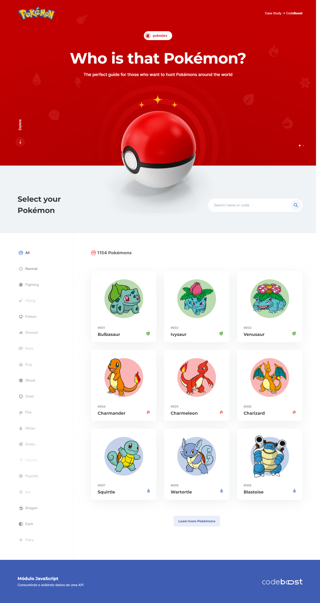

# Projeto Pokémon

Clique no ícone para acessar o site do projeto
 

## Descrição

Projeto desenvolvido para apresentar os Pokémons e suas principais informações como uma Pokédex.

Para desenvolver esse projeto foi utilizado:

- PokeAPI como fonte de dados e AXIOS para requisição;
- Ambiente automatizado com Gulp;
- Biblioteca SwiperJS (slides);

## Tecnologias utilizadas

  
 
 

## Como usar

### Clone esse repositório
`$ git clone https://github.com/anderson-rodriguesdev/projeto-pokemon.git`

### Instale as dependências
`$ npm install`

### Inicie o projeto com o comando:
`$ gulp`
 

# Layout
